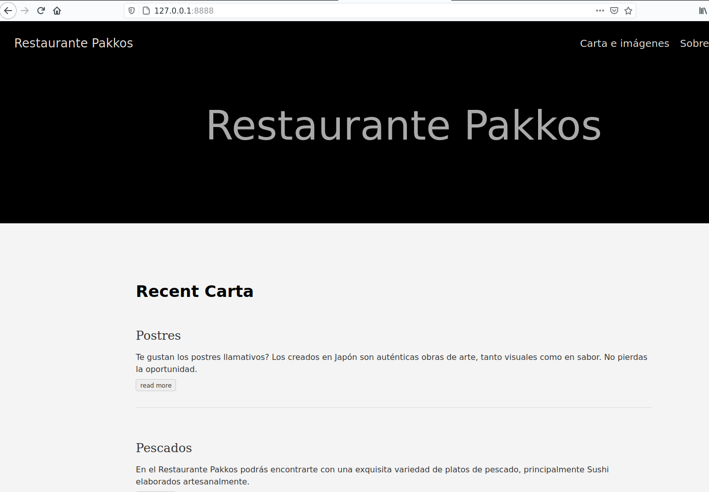

# **DOCKER**

## **1**. Instalación

Primeramente procederemos a instalar el paquete de docker en nuestro equipo, aunque para ello deberemos añadir el repositorio correspondiente. 

para empezar instalaremos los siguiente paquetes:

- sudo apt-get update
- sudo apt-get install apt-transport-https
- sudo apt-get install ca-certificates
- sudo apt-get install curl
- sudo apt-get install software-properties-common

Ahora procederemos a descargar la clave GPG de Docker
- curl -fsSL https://download.docker.com/linux/ubuntu/gpg|sudoapt-keyadd-

Ahora añadiremos el repositorio
- sudo add-apt-repository "deb[arch=amd64]https://download.docker.com/linux/ubuntu $(lsb_release-cs) stable"

Y si todo ha ido sin problemas, prodemos instalar docker

- sudo apt-get install docker-ce

## **2**. Configuración
Para poder añadir el sitio web, primeramente activaremos docker y descargaremos el contenedor de nginx

- sudo systemctl enable docker
- docker pull nginx

Y en un principio solo nos quedaría mover nuestra página creada con hugo a Nginx

- docker run -d -p puertos:puerto --name nombre -v /home/usuario/Escritorio/restaurante/public:/usr/share/nginx/html:ro nginx

Ahora simplemente para acceder solamente indicaremos la dirección Ip del local host y especificando los puertos indicados en el comando, el resultado sería el siguiente:  
  

