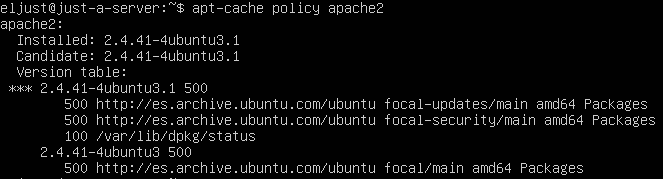
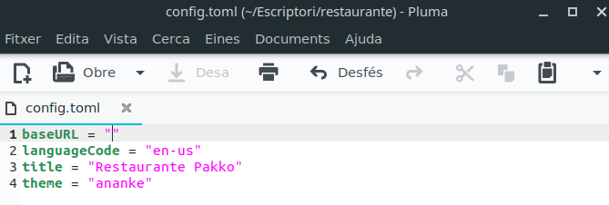
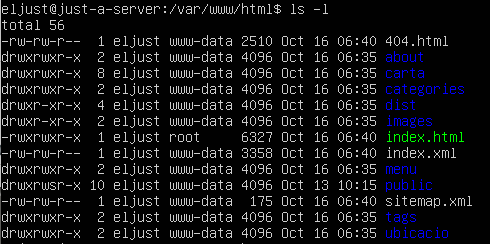
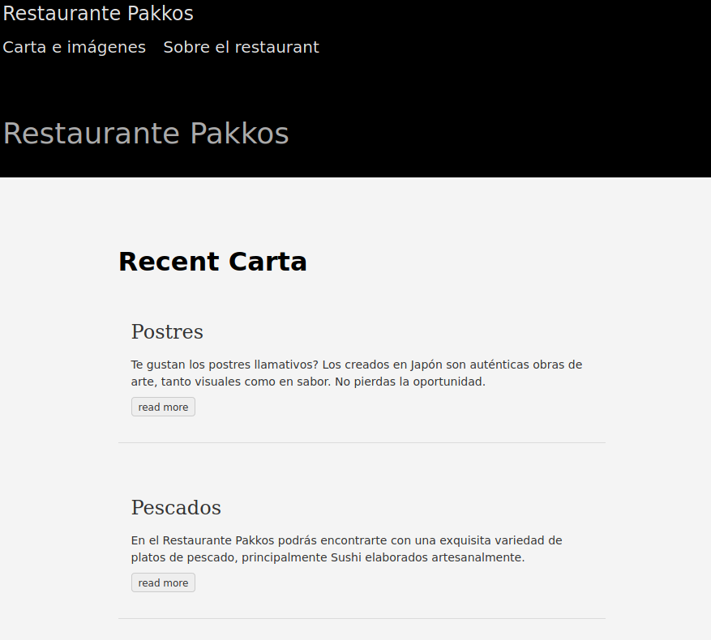
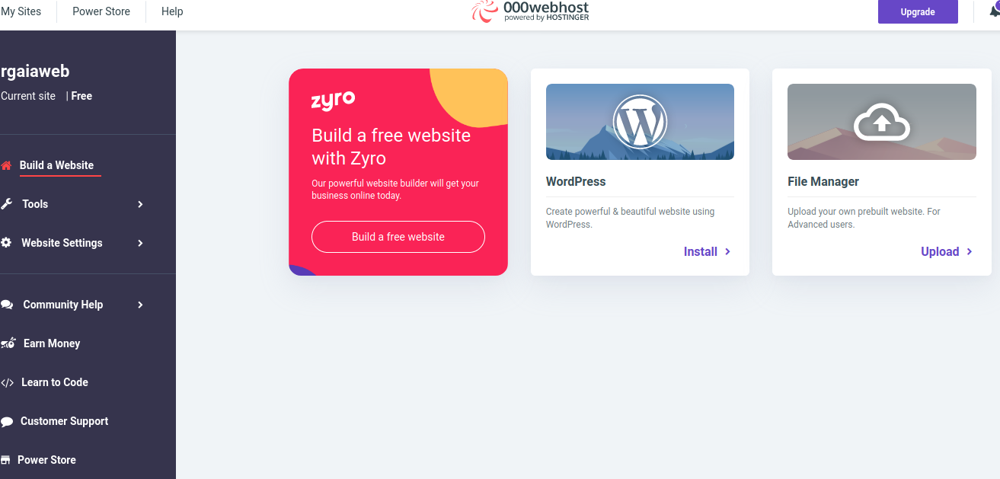
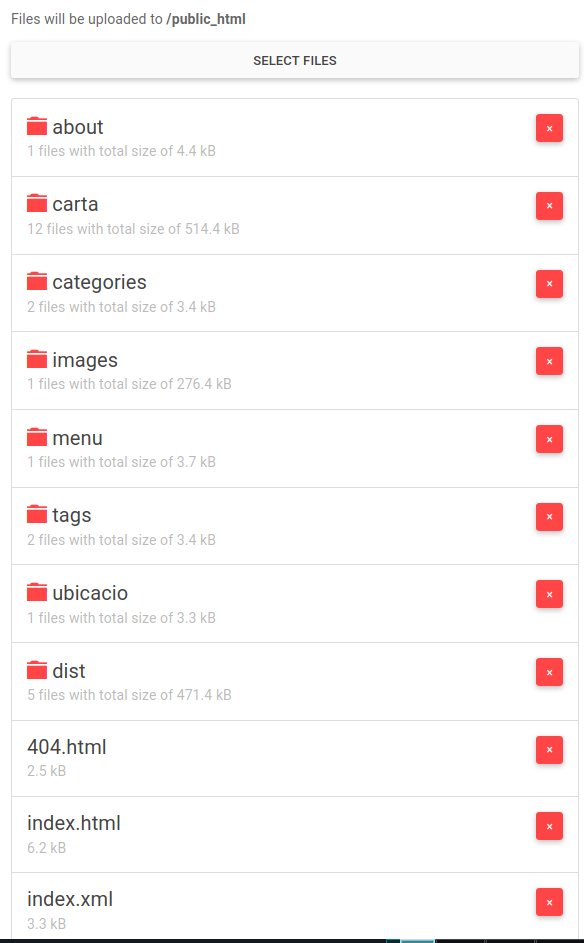
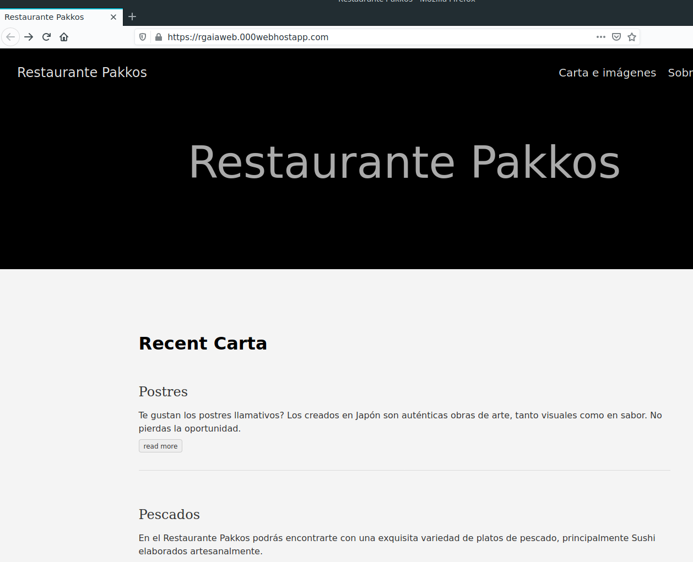

# **Guía de Instalación Web**

### UBUNTU SERVER
Para instalar nuestro servidor, primeramente deberemos comprobar que el apache2 está instalado en nuestra máquina servidor usando el comando **"apt-cache policy apache2"**. En el caso de tenerlo, nos indicará la versión instalada y si hay alguna actualización para el paquete.

En el caso de no tenerlo instalado o actualizado, procederemos a hacerlo con un ***"apt install apache2"***

Una vez instalado, nos moveremos a la siguiente ruta: ***/var/www/html***, ahí, al hacer un *ls* nos daremos cuenta de que la carpeta pertenece a root y eso podría ser un problema de seguridad muy grave, por lo que procederemos a cambiar los permisos de la siguiente manera:

*usermod -a -G www-data usuario*
*chmod -R 775 /var/www/html*
*chmod -R g+s /var/www/html*
*chown -R usuario /var/www/html*
*chgrp www-data /var/www/html*

Con estos cambios no deberíamos tener problemas a la hora de modificar el contenido de la carpeta

En un principio la cosa ya la tendríamos configurada, ahora procederemos a preparar el sitio para poder subirlo a nuestro servidor Apache. Para ello usaremos hugo

### HUGO
Para asegurarnos de que la página web se visualiza correctamente en nuestro servidor, deberemos modificar el fichero llamado **"config.toml"** dentro de la carpeta de nuestra página web y cambiar el valor de la **"base-url"**

En mi caso, ya tenemos una página hecha, por lo que para poder subir los archivos haremos lo siguiente: primero iniciaremos el servidor de hugp con el siguiente comando (teniendo en cuenta que hay que estar dentro de la carpeta de la página web): ***hugo server -D***

Una vez iniciado, ejecutaremos el comando ***hugo*** tal cual, generando así una carpeta llamada **public** dentro de la carpeta de nuestra página web.

Ahora podremos proceder a insertar nuestra página en el servidor, para ello podremos hacer uso del comando scp y copiarlo desde ssh a nuestro sevidor. Lo que procederemos a copiar es el interior de la carpeta ***public***

***scp -R public/ usuario@X.X.X.X:/var/www/html/*** (si es desde el cliente)
***scp -R usuario@X.X.X.X:/ubicación/de/public/ /var/www/html*** (si es desde el servidor)

Una vez completados todos los pasos, el resultado será algo similar al siguiente

Ahora simplemente accediendo a la dirección IP que tenga nuestro servidor web apache deberíamos acceder sin problemas a todo el contenido de la página:

# HOSTING
Para subir nuestra web a un servidor de Hosteo, los pasos son prácticamente los mismos, conseguir la carpeta public en nuestra web con hugo, una vez la tenemos, procederemos a subirla a un servidor de hosteo gratuito, 00WebHost.com es nuestra opción elegida.

Una vez creada nuestra cuenta, procederemos a crear un sitio web especificándole un nombre

Acto seguido, le daremos a la opción de ***"upload files"*** y subiremos el contenido de nuestra carpeta Public

Una vez hecho, accederemos al enlace de nuestra web y debería mostrarla sin problemas
